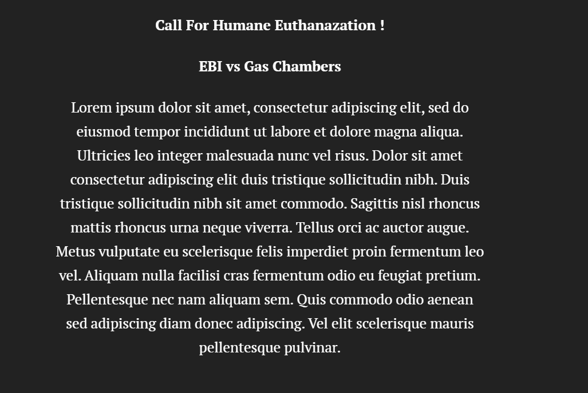

# Part I

## Project Outline
**High-level Summary:** My final presentation will highlight the status of animal shelters, euthanasia statistics, and the importance of animal adoption from shelters. I hope to appeal to people, not only to adopt from animal shelters, but also to consider donating to causes that allow shelters to run and allow animals to be adopted and relocated.

Inspired by the content underscored in our textbook, Good Charts, as well as recommendations made during our course lectures, my story structure will split into: build up, conflict, and call to action.

**Build Up:** Highlight the shelter intake, transfer, and euthanasia rates over the last few years. 
 
**Conflict:** Shelters are often overwhelmed with intakes. Animals are euthanized for many preventable reasons. 
 
**Call To Action:** Illustrate that there has been a direct correlation with increase in adoption and decrease in euthanisation. Futher illustrate that animals in certain organizations' shelters are euthanized for various reasons and provide methods of contributing to these animals' adoptability and supporting these organizations. 

## Sketches

I decided to sketch a rough flow of my entire presentation. I will begin with stark statistics about shelters and adoption. In my final presentation, I hope to also provide general information about pets in American households. I will then display the direct correlation with adoption and decrease in euthanasia to appeal to the emotions of the audience. Diving into more detail, I want to highlight that agencies, over time, have taken great control over many of the sheltering issues that have existed in the past. Thus, euthanasia reasons stem from something greater and other than overpopulation. To further prevent euthanasia we must donate to these agencies as well as campaigns that aid in resolving these other issues. 
 

 

## The Data
The [Shelter Animal Outcomes data from the Austin Animal Center](https://www.kaggle.com/c/shelter-animal-outcomes/data) has attributes such as animal breed, intake reason, outcome, and outcome reason from 2013 - 2016; these attributes are valuable in drawing insights on shelter animal trends over time.
The [ASPCA Shelter Intake Data](https://www.aspca.org/animal-homelessness/shelter-intake-and-surrender/pet-statistics) provides nationwide information on the status quo of U.S. animal shelters as provided by the Animal Humane Society. This dataset will not only complement the Austin Animal Center data, but also describe the conflict at hand by explaining why animals may be rehomed. 
Lastly, the [NYT Why Euthanasia Rates Have Plummeted](https://www.nytimes.com/2019/09/03/upshot/why-euthanasia-rates-at-animal-shelters-have-plummeted.html) article directly supports the hypothesis that euthanasia and adoption rates are negatively correlated. 

## Method & Medium 
I intend to use Flourish and Shorthand as my visualization and presentation platforms for this project. 

I will use Flourish because it has proved to be my favorite among the platforms we've overviewed this semester. It's versatility is not qualified by the ease of use and simplicity in edited and personalization visualizations. The ability to dynamically add data and view changes instantaneously is particularly of interest to me because much of the data I've gathered has to be manually input and comes from various sources. 

I will used Shorthand to compile my story together. The interactivity and transitions present on Shorthand will surely garner attention as I present my findings. Using features such as "Scrollmation," "Reveal," and "Custom HTML," I will be able to highlight certain aspects of my story and visualizations while maintaining engagement of my audience. Creating very different but interactive sections that come together will aid in the flow of my story and allow me to conclude with my call to action. 

# Part II 
## Wireframe/Storyboarding Using Shorthand 

## User Research/Interviews 
**Target Audience:**
This cause can appeal to various groups - as indicated by those I targeted to interview. I hope to appeal to those considering to adopt, those who maybe interested in just aiding the cause, and inspiring those who were unaware of the issue and did not care for animals. 
 
**Who To Interview:**
I think the best interview subjects need to be random as any good representive survey should. Thus, I hope to have 3 individuals with varying perspectives on domestic animals. I will interview:
 
A. Someone who already has a pet from a shelter to guage whether my persuasion and visuals conveys what she is similarly passionate about - or whether I am lacking in something important to the cause.
 
B. Someone who is ambivalent towards pets and animals in general. The cause may be saddening, but they wouldn't necessarily raise an animal. Thus, I can guage whether they are motivated to donate or learn more about the cause.
 
C. Someone completely uninterested in raising an animal; dislikes pets. 
 
**Interview Script:**
Hi, thank you for agreeing to take part in this interview. I hope to gather general feedback to improve the scope of my project. I want you to be critical and honest, there are no wrong answers! 
 
Questions:
1. What was your take away from this presentation?
2. Were you able to understand the purpose of the visualizations? 
3. Do you feel differently about the issue now? 
4. How was the aesthetic coherency? 
Thank you again for taking part in this!

**Findings:**
 

|  Questions |  Feedback |
| --------- |:----|
| What was your take away from this presentation? | The biggest takeaway was clear to all three of my participants."It is clear that you want to either aid in decreasing the euthanization rate or aid shelters in better taking care of animals."    |
| Were you able to understand the purposes of the visualizations? | Yes. I was advised to add another visualization quantifying the ratio of euthanized to adopted/alive animals.  |
| Do you feel differently about the issue now? | All of my participants were not aware the many states still used inhumane methods of euthanization. The one who does not like animals said that she would be willing to donate and sign petitions to outlaw this method. |
| How was the aesthetic coherency? | I was advised to not switch between light and dark mode on Shorthand. I informed my participants that my visualizations were just placeholders, but they will be color coordinated for the final version. Other than that, they thought the logical flow was fine. |

**Future Changes:**
  
For my final version of the project, I will add additional visualizations that quantify the issue better. I will also organize and unify the design scheme used across all the visualizations. I will provide meaningful text analysis to accompany the visualizations and aid my story telling during the presentation. 
 

# Part III
## Since Part II, Additions & Reflections
 
My final story appeals still appeals to a fairly general audience. I would narrow it down to anyone passionate about animal rights because of the details regarding inhumane euthanization methods. The story can apply to anyone from looking to adopt more ethically, to someone unaware of the shelter system and euthanization statistics looking to learn more. 

Putting together the pieces of data visualizations coherently in a way that flowed was difficult. I wanted to use some of the persuasion techniques that we went over in lecture and in our workbook exercises. I hoped that the flow of my story is not only logical but addresses the different level of  issues involved and encourages people to consider one of the three calls to action I provide. 

Since Part II, I completed all my visualizations and put the story together. From a design perspective, my feedback from the interview rang repeatedly. I attempted to stick to a color scheme and dark colors and images throughout the presentation. Rather than narrowing focus, I needed a better transition between two issues. Finally, I think my flow and transition between discussing euthanization as an issue into acknowledging that euthanization is often inevitable allows for a logical flow into advocating for ethical euthanization at the very least. 

**[Final Presentation](https://carnegiemellon.shorthandstories.com/shelter-animals---euthanasia-in-the-u-s-/index.html)**

## Final Data & Information Sources Used
 
Sources:
 
[1]"Lifesaving statistics", Animal Humane Society, 2019. [Online]. Available: https://www.animalhumanesociety.org/about/lifesaving-statistics. [Accessed: Dec - 07 - 2020].
 
[2]"Shelter Animals Count | Explore the Data | Timeline", Shelteranimalscount.org, 2019. [Online]. Available: https://shelteranimalscount.org/data/Explore-the-Data/explore-the-data-timeline. [Accessed: Dec - 07 - 2020] .
 
[3]"Pet Statistics", ASPCA. [Online]. Available: https://www.aspca.org/animal-homelessness/shelter-intake-and-surrender/pet-statistics. [Accessed: Dec - 07 - 2020] .
 
[4]" Gas Chamber Euthanasia: What you might not know about your local animal shelter ", labroots, 2016. [Online]. Available: https://www.labroots.com/trending/plants-and-animals/3090/gas-chamber-euthanasia. [Acessed: Dec - 8 - 2020].

### Return To Home
[MAIN](/README.md)
